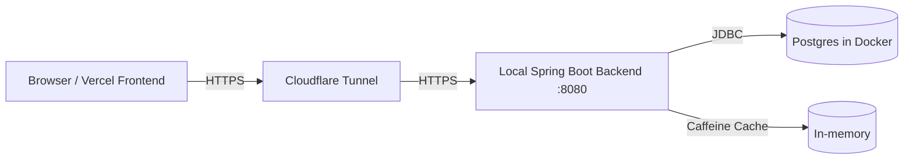

# URL Shortener (V1) — Spring Boot 3 (Java 21) + Postgres + Caffeine + Cloudflare Tunnel + Vercel

Production-grade showcase URL shortener with:

- `POST /api/v1/shorten` (single insert, no code column)
- `GET /api/v1/shorten/{code}` (metadata)
- `GET /{code}` (302 redirect or preview interstitial)
- Deterministic scrambling + Base62 codes (anti-enumeration, no collisions)
- Caffeine cache on redirect hot path
- Virtual threads + load shedding (429/503 fast-fail)
- Best-effort async click counting (batched DB increments)

## Architecture (V1)



## Quickstart (Local)

### Prereqs

- Java 21
- Docker Desktop
- Node 20+ + pnpm (frontend later)
- cloudflared (Phase 3)

### 1) Start Postgres

```bash
cd infra
docker compose up -d
docker compose ps
```

Verify:

```bash
docker exec -e PGPASSWORD=shortener -it shortener-postgres \
  psql -U shortener -d shortener -c "select 1;"
```

### 2) Run Backend (IntelliJ)

Set env vars in your Spring Boot Run Configuration:

- `SHORTENER_SCRAMBLE_KEY=dev-only-change-me-0123456789abcdef-very-long`
- `SHORTENER_PUBLIC_BASE_URL=http://localhost:8080`
- `CORS_ALLOWED_ORIGINS=http://localhost:5173`

Verify:

- Swagger: `http://localhost:8080/swagger-ui/index.html`
- Health: `http://localhost:8080/actuator/health`
- Prometheus: `http://localhost:8080/actuator/prometheus`

## API Contract (V1)

### Create

```bash
curl -s -X POST "http://localhost:8080/api/v1/shorten" \
  -H "Content-Type: application/json" \
  -d '{"url":"https://example.com/path?q=1","preview":false}' | cat
```

### Metadata

```bash
curl -s "http://localhost:8080/api/v1/shorten/<code>" | cat
```

### Redirect (use GET, not HEAD)

```bash
curl -s -o /dev/null -w "%{http_code}\n" "http://localhost:8080/<code>"
curl -I "http://localhost:8080/<code>"  # shows Location header but may not execute controller body for click tracking
```

## Design notes

- Codes are derived (no `code` column): `id -> scramble -> Base62(code)`
- Redirect: `code -> Base62 decode -> unscramble -> id -> SELECT`
- Caching: `code -> resolved payload` (TTL ~ 5–30 min)
- Click count: best-effort, batched increments; dropping analytics is allowed during overload.

## Docs

- System design: `docs/design.md`
- ADRs: `docs/adr/`
