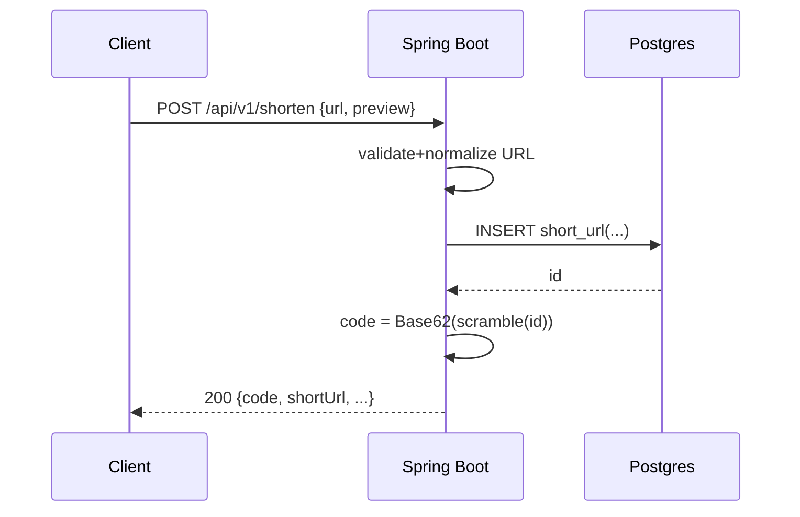
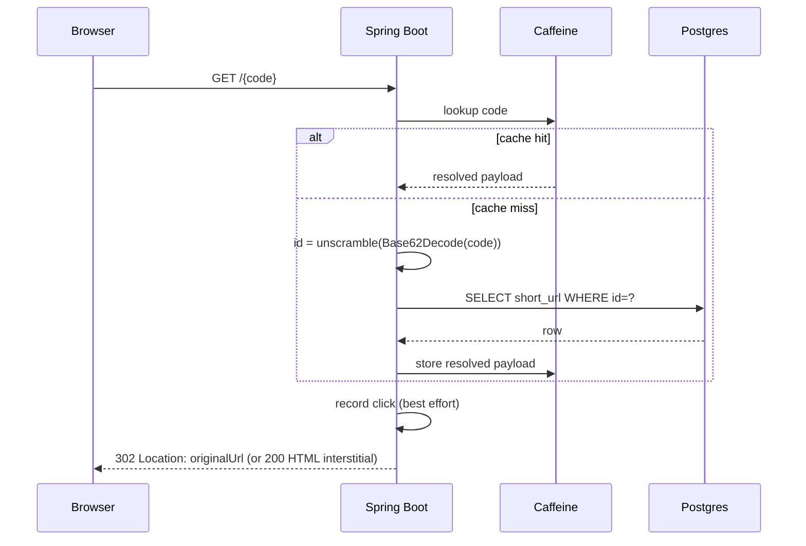

# URL Shortener — System Design (V1)

## Goals
- Single write on create (no code column)
- Collision-free deterministic code generation
- Redirect is one DB read (and cacheable)
- Strong validation + ProblemDetails errors
- Virtual threads + backpressure + graceful degradation
- Free-tier friendly; local backend publicly reachable via Cloudflare Tunnel

## Data model (V1)
Table: `short_url`
- `id BIGSERIAL` (PK)
- `original_url TEXT NOT NULL`
- `preview_enabled BOOLEAN NOT NULL DEFAULT false`
- `created_at TIMESTAMPTZ NOT NULL`
- `expires_at TIMESTAMPTZ NOT NULL` (created + 2 years)
- `click_count BIGINT NOT NULL DEFAULT 0`

No `code` column. Code is computed.

## Code generation
1) Insert row → DB generates `id`
2) `publicId = scramble(id, key)`
3) `code = Base62(publicId)`

Reverse lookup:
1) `publicId = Base62Decode(code)`
2) `id = unscramble(publicId, key)`
3) SELECT by `id`

## Request flow: Create

## Request flow: Redirect

## Backpressure / load shedding
- `POST /api/v1/shorten`:
  - rate-limited (token bucket) → 429 + Retry-After
  - DB bulkhead semaphore → 429/fast-fail if saturated
- `GET /{code}` (redirect):
  - DB bulkhead → 503 if overloaded/unavailable (fast-fail)
  - tight retry caps for transient DB errors

## Click counting
- Redirect stays fast.
- Best-effort: enqueue increments in memory, flush batches periodically.
- Under overload: dropping analytics is acceptable; redirect correctness wins.

## Observability
- Actuator health + metrics
- Prometheus endpoint
- Cache stats + retry metrics + click tracking counters
- RequestId in responses/logs

## Public demo (Phase 3)
- Backend local exposed via Cloudflare Tunnel
- Frontend on Vercel calls API via tunnel URL
- Tight CORS: allow only Vercel domain + localhost
